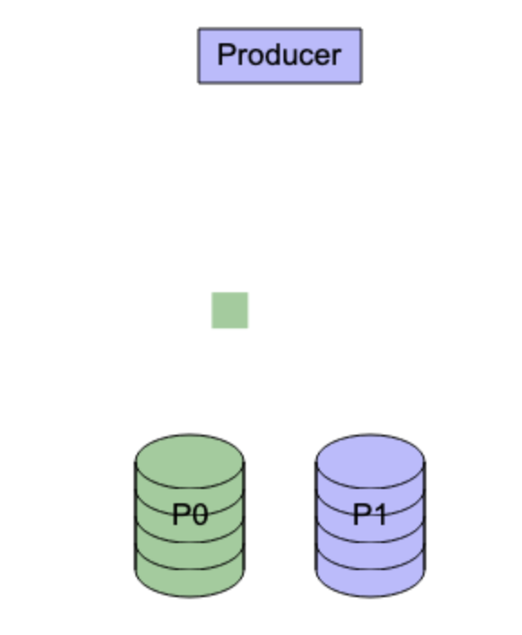

# animated-diagram
use yaml to describe a diagram including movements to make the diagram animated

<a href="https://handstand2002.github.io/viewer.html#H4sIAAAAAAAAE8WUwVLCMBCG732KHTxwwkmL4DQ3ZfTMjB70mLaBRkLSSVIEn940bbAWi46DmNv+ze7++bpJSsSGaBwA5JQtc4PhCiEbvbLM5D5ISLpaKlmKrNoIkEouFYbBxb1bgyBYy4xieHi8mwcyeaGpcSVHIMja6oWSWZlS5ZJZKkVdBkDnpLDflU0gYslpI3srY9QIjZvYx3sDt3ZVBiqRk4RyX3lDeGkrz9udAeRioal5wjAaTz5Jzxi8sJDCth6G18UWbhQjfOjNmh23JRPJs882Em75OKmQmhn2cb4thgh50zuLc9Kmgvp4ZMSQhOgujmkHx/QARxzPZnF8BAc6ABGiM4EIJy0QY0dlTyI8OYlvByP8PxJRP4msl0TfHYk6KKKjKOzhSsOZoL46gMlZuhJUawzo50NcrTd7I+O47T46vfv2SP+F+0AbWjSvlVFE1Nnap3d+zFcdXJdLbYgy7V6un5f3XevN1L6krTGotzrRj8MxK9HJrYS/tXJGKsE7q1oquqsGAAA=" target="_blank"></a>

*Click to view live animation*

This project was created by describing requirements to ChatGPT

## Run Locally
### Requirements
- Python3

### Procedure
from terminal:
```bash
./server-start.sh
```

## Formal Grammar Specification for Diagram YAML

Based on the parsing logic in `script.js` (including `VALID_MODES`, `EXPECTED_PROPERTIES`, and transition processing functions), the following is the formal grammar for the supported YAML schema in this project. 

The specification is represented in Extended Backus-Naur Form (EBNF) mapping to standard YAML structures.

### Core Structure
```ebnf
Document = "mode:", ModeValue,
           [ "config:", Config ],
           [ "canvas:", Canvas ],
           [ "color:", ColorPalette ],
           [ "template:", Templates ],
           [ "anchors:", { Anchor } ],
           [ "objects:", { Object } ],
           ( "transitions:", { Transition } | "steps:", { Step } ) ;

ModeValue = "PLAIN" | "STEP" ;
```

### Setup & Configuration
```ebnf
Config = [ "frameRate:", Integer ],
         [ "step:", StepConfig ] ;

StepConfig = [ "duration:", DurationConfig ],
             [ "interval:", IntervalConfig ] ;

DurationConfig = [ "default:", Number ],
                 [ "max:", Number ],
                 [ "objCountCoefficient:", Number ] ;

IntervalConfig = [ "default:", Number ],
                 [ "max:", Number ],
                 [ "objCountCoefficient:", Number ] ;

Canvas = [ "width:", Number ],
         [ "height:", Number ],
         [ "background:", BackgroundConfig ] ;

BackgroundConfig = [ "color:", ColorString ] ;

ColorPalette = "palette:", String ;
```

### Definition Elements (Anchors & Templates)
```ebnf
Anchor = "- name:", String,
         "  x:", Number,
         "  y:", Number ;

Templates = [ "object:", { ObjectTemplate } ],
            [ "transition:", { TransitionTemplate } ] ;

ObjectTemplate = "- name:", String,
                 ObjectProperties ;

TransitionTemplate = "- name:", String,
                     TransitionProperties ;
```

### Drawing Objects
```ebnf
Object = "- name:", String,
         ObjectProperties ;

ObjectProperties = [ "templates:", { String } ],
                   "icon:", IconConfig,
                   [ "position:", PositionConfig ],
                   [ "label:", LabelConfig ] ;

IconConfig = "shape:", ShapeType,
             [ "color:", ColorString ],
             [ "outline:", OutlineConfig ],
             (* size is only allowed if ShapeType is star, cloud, cat, or dog *)
             [ "size:", Number ],
             (* width/height are allowed if ShapeType is rectangle, database, line, line-arrow, or arrow *)
             [ "width:", Number ],
             [ "height:", Number ] ;

ShapeType = "rectangle" | "star" | "cloud" | "database" | "line" | "line-arrow" | "arrow" | "cat" | "dog" ;

OutlineConfig = [ "thickness:", Number ],
                [ "color:", ColorString ] ;

PositionConfig = [ "x:", Number ],
                 [ "y:", Number ],
                 [ "z:", Number ],
                 [ "anchor:", String ] ;

LabelConfig = [ "offsetX:", Number ],
              [ "offsetY:", Number ],
              [ "font:", String ],
              [ "style:", String ],
              [ "color:", ColorString ],
              [ "value:", String ] ;
```

### Transitions & Steps
Transitions differ based on whether the document mode is `PLAIN` or `STEP`. In `PLAIN` mode, `timeStart` and `timeEnd` are required. In `STEP` mode they are inferred and must NOT be present. 

```ebnf
Transition = "- name:", String,
             TransitionProperties ;

TransitionProperties = [ "timeStart:", Number ],  (* Required for PLAIN mode, prohibited in STEP mode *)
                       [ "timeEnd:", Number ],    (* Required for PLAIN mode, prohibited in STEP mode *)
                       [ "strategy:", StrategyValue ],
                       [ "position:", TransitionPositionConfig ],
                       [ "label:", TransitionLabelConfig ],
                       [ "icon:", TransitionIconConfig ],
                       [ "templates:", { String } ] ;

StrategyValue = "linear" | "cosine" | CustomFunctionString ;

TransitionPositionConfig = [ "x.start:", Number ], [ "x.end:", Number ],
                           [ "y.start:", Number ], [ "y.end:", Number ],
                           [ "z.start:", Number ], [ "z.end:", Number ],
                           [ "anchor.start:", String ], [ "anchor.end:", String ] ;

TransitionLabelConfig = [ "offsetX.start:", Number ], [ "offsetX.end:", Number ],
                        [ "offsetY.start:", Number ], [ "offsetY.end:", Number ],
                        [ "color.start:", ColorString ], [ "color.end:", ColorString ] ;

TransitionIconConfig = [ "color.start:", ColorString ], [ "color.end:", ColorString ],
                       [ "size.start:", Number ], [ "size.end:", Number ],
                       [ "width.start:", Number ], [ "width.end:", Number ],
                       [ "height.start:", Number ], [ "height.end:", Number ],
                       [ "outline:", TransitionOutlineConfig ] ;

TransitionOutlineConfig = [ "thickness.start:", Number ], [ "thickness.end:", Number ],
                          [ "color.start:", ColorString ], [ "color.end:", ColorString ] ;

Step = "- ", [ "durationMultiplier:", Number ],
             [ "nextInterval:", Number ],
             [ "transitions:", { Transition } ] ;
```

### Base Types
```ebnf
String       = ? Any valid YAML string ? ;
ColorString  = ? Any valid CSS color string, hex code, or valid palette shortcut (e.g. p0, p1) ? ;
Number       = ? Any valid numeric value (integer or float) ? ;
Integer      = ? Any valid integer value ? ;
CustomFunctionString = ? Matching the regex: /^ *[a-zA-Z][a-zA-Z0-9_]* *=>/ ? ;
```